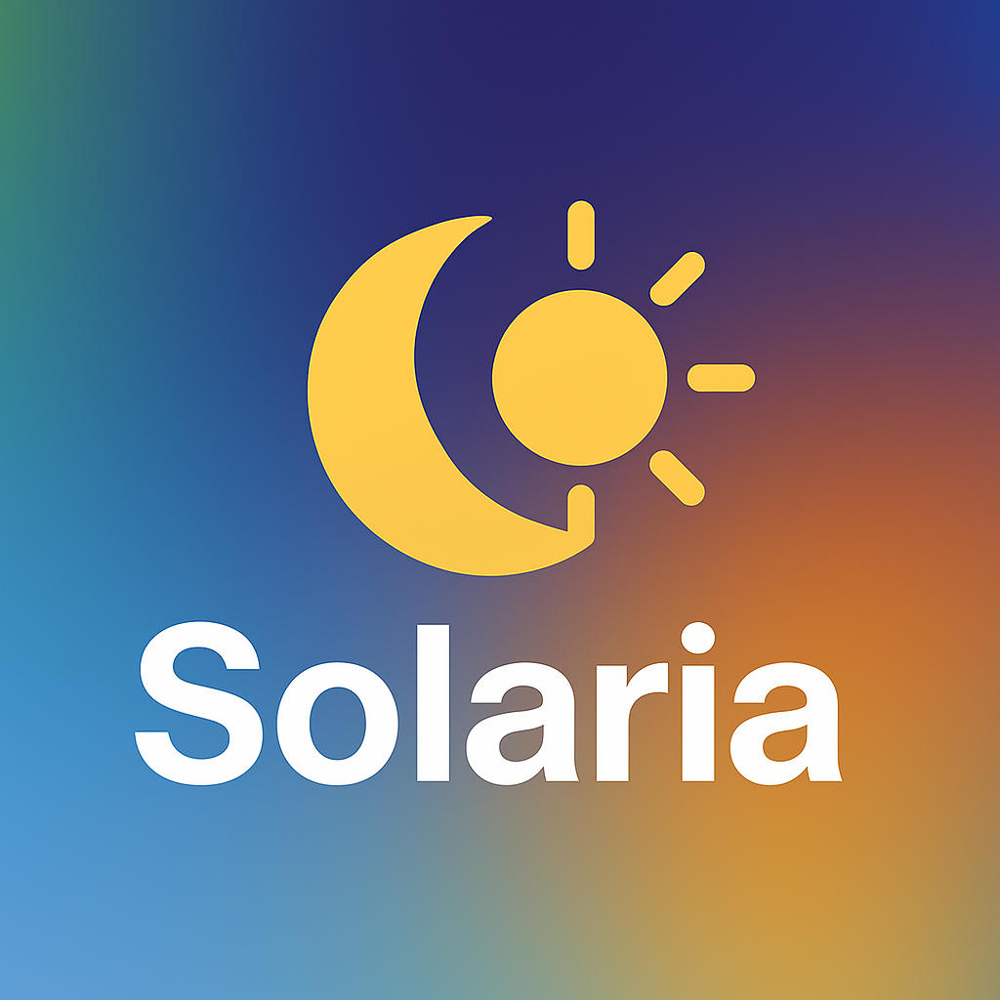

# Solaria Theme


**Solaria Theme** is a minimalist and developer-friendly VS Code color theme pack featuring **Solaria Light** and **Solaria Dark** variants. Inspired by Nordic minimalism and the Tailwind CSS color palette, Solaria offers a harmonious balance of soft, eye-friendly colors and precise syntax highlighting. Whether coding during the day or night, Solaria ensures a comfortable and productive experience with clear differentiation of code elements.

## The Story Behind Solaria Theme
Curious about why I created Solaria Theme? Check out [the story](STORY.md) behind its Nordic-inspired design and Tailwind CSS colors!

## Features

- **Dual Themes**: Choose between **Solaria Light** (bright and airy) and **Solaria Dark** (deep and calming) to match your workflow.
- **Optimized Syntax Highlighting**: Tailored for JavaScript, TypeScript, HTML, CSS/SCSS, PHP, Python, Java, C/C++, Ruby, JSX/TSX, and more.
- **Semantic Highlighting**: Full support for modern language features, ensuring accurate coloring for variables, functions, and classes.
- **Tailwind CSS Support**: Enhanced highlighting for utility classes, SCSS variables, and mixins.
- **Accessibility**: Colors meet WCAG 2.1 contrast standards for readability and reduced eye strain.
- **Subtle UI Design**: Clean and minimal UI elements for a distraction-free coding environment.

## Preview
### Solaria Light

<div><em>Clean and bright, perfect for daytime coding.</em></div><br>

### Solaria Dark
<br>
<div><em>Deep and calming, ideal for night-time coding.</em></div>

---

## Icon


---

## Installation

1. Download from the [Marketplace](https://marketplace.visualstudio.com/items?itemName=ovcharovcoder.solaria-theme) or  [VS Code Themes](https://vscodethemes.com/e/ovcharovcoder.solaria-theme/solaria-dark)
2. Select the theme via `Preferences → Color Theme → "Solaria Light" or "Solaria Dark"`

## Customization

You can customize Solaria Theme by overriding colors in your VS Code settings:

```json
"editor.tokenColorCustomizations": {
  "[Solaria Light][Solaria Dark]": {
    "textMateRules": [
      {
        "scope": "variable",
        "settings": {
          "foreground": "#your-custom-color"
        }
      }
    ]
  }
}
```
---

## Changelog

See the [CHANGELOG.md](https://github.com/ovcharovcoder/solaria-theme/blob/main/CHANGELOG.md) for details on updates and improvements.

## Development Date  
- Developed: May 2025

---

## Author

- Andriy Ovcharov
-  E-mail: ovcharovcoder@gmail.com

---

## License

<a href="LICENSE">MIT</a>

