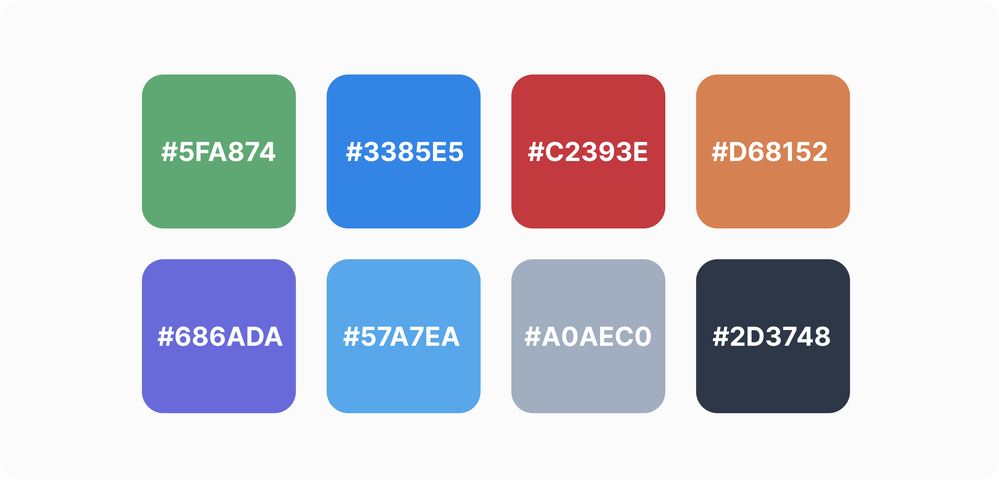

# Solaria Theme

**Solaria Theme** is a minimalist and developer-friendly VS Code color theme pack featuring **Solaria Light** and **Solaria Dark** variants. Inspired by Nordic minimalism and the Tailwind CSS color palette, Solaria offers a harmonious balance of soft, eye-friendly colors and precise syntax highlighting. Whether coding during the day or night, Solaria ensures a comfortable and productive experience with clear differentiation of code elements.

## Features

- Two theme variants: Light (Solaria Light) and Dark (Solaria Dark) to suit your preferred mode anytime.
- Precise syntax highlighting for JavaScript, TypeScript, HTML, CSS/SCSS/SASS, PHP, Python, Java, C, C++, Ruby, JSX/TSX, and React.
- Full support for Tailwind CSS utility classes, Sass/SCSS variables and mixins, and DOM API methods.
- Optimized color palette for clear differentiation of comments, functions, variables, and keywords — enhancing readability and reducing eye strain.

## Preview

---

## Icon

## Сolor Palette 

---

## Installation

1. Download from the [Marketplace](https://marketplace.visualstudio.com/items?itemName=ovcharovcoder.solaria-theme) or  [VS Code Themes](https://vscodethemes.com/e/ovcharovcoder.solaria-theme/solaria-dark)
2. Select the theme via `Preferences → Color Theme → "Solaria Light" or "Solaria Dark"`

---

## Development Date  
- Developed: May 2025

---

## Author

- Andriy Ovcharov
-  E-mail: ovcharovcoder@gmail.com

---

## License

<a href="LICENSE">MIT</a>

