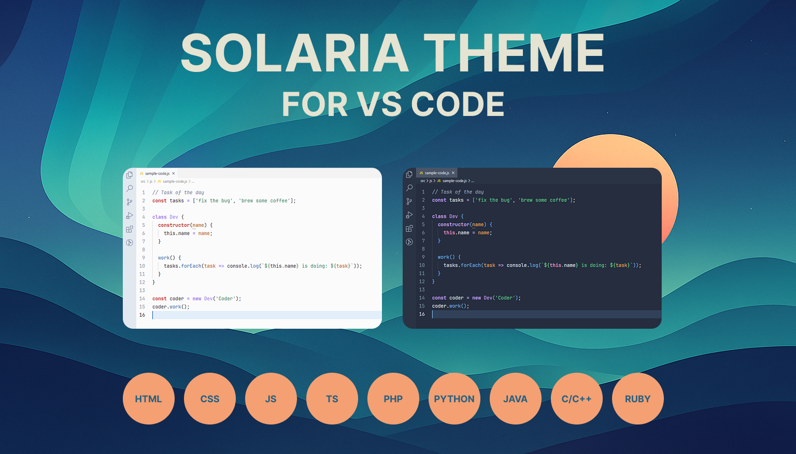
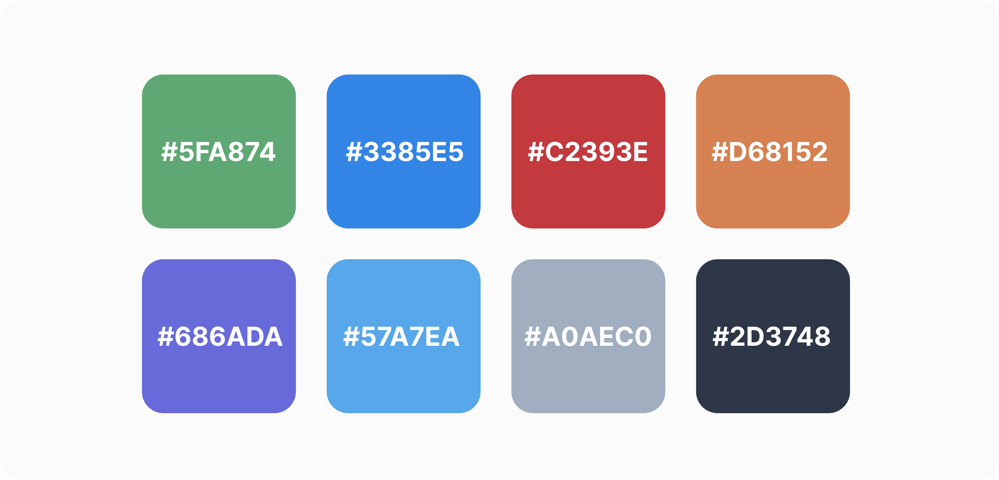

## The Story Behind Solaria Theme

Hi, I’m Andriy Ovcharov, a frontend developer with a passion for crafting beautiful and functional digital experiences. As someone who spends hours in VS Code, I’ve always believed that a great theme can transform coding from a routine task into something truly enjoyable. This is the story of how Solaria Theme came to life—a journey fueled by inspiration, design, and a desire to create something uniquely mine.

### My Journey as a Frontend Developer

Like many frontend developers, I’ve spent years exploring the vast ecosystem of VS Code themes. From vibrant, neon-drenched palettes to sleek, minimalist designs, I tried them all. Each theme had something special—whether it was crisp syntax highlighting, a calming color scheme, or support for my favorite languages like JavaScript, TypeScript, and SCSS. But as much as I loved these themes, I often found myself thinking, “What if I could combine the best parts of all of them?”

As my skills evolved, I dove into web design, learning the art of color theory, typography, and user experience. I started to see code editors not just as tools but as canvases where aesthetics and functionality intertwine. That’s when the idea hit me: why not create my own VS Code theme? One that reflects my taste, solves my pain points, and brings joy to other developers.

### The Spark of Inspiration

The idea for Solaria Theme was born from my love for Nordic minimalism—clean lines, soft colors, and a sense of calm that makes you feel at home. I was also deeply inspired by the Tailwind CSS color palette, which strikes a perfect balance between vibrancy and subtlety. Themes like Nord, Dracula, and One Dark Pro showed me how powerful a well-designed theme could be, with their thoughtful syntax highlighting and polished UI. I wanted to take the best elements from these themes—clear differentiation of code elements, eye-friendly colors, and a cohesive look—and blend them with my own vision.

My goal was ambitious but clear: create a theme that feels just right for long coding sessions, whether you’re debugging JavaScript at 2 a.m. or styling a webpage in broad daylight. I wanted a theme that’s versatile enough for frontend developers like me, backend coders working in Python or Java, and everyone in between.

### Crafting Solaria Theme

Creating Solaria Theme was a labor of love. I started by sketching out a color palette that felt both modern and timeless. The Nordic aesthetic guided me toward soft, muted tones, while Tailwind CSS inspired pops of color for syntax elements like functions (#7BB8F0), strings (#68D391), and keywords (#C4A1F8). I spent hours tweaking hues to ensure they met WCAG 2.1 accessibility standards, so every developer could use the theme comfortably. 

The process wasn’t without challenges. Balancing the light (Solaria Light) and dark (Solaria Dark) variants was like choreographing a dance—each had to shine on its own while staying in harmony with the other. I meticulously mapped out color associations so that switching between themes felt seamless, with functions, variables, and keywords retaining their visual identity. Semantic highlighting was another puzzle, but adding support for tokens like parameter and decorator made the theme feel modern and robust.

As a frontend developer, I paid special attention to languages like JavaScript, TypeScript, and SCSS, ensuring Tailwind CSS utilities and SCSS variables pop with clarity. But I didn’t stop there—support for Python, PHP, Java, C++, and more makes Solaria a theme for all coders. The UI elements, from the sidebar to the tabs, were designed to be unobtrusive yet intuitive, letting the code take center stage.

### Why Solaria Theme Matters to Me

Solaria Theme is more than just a collection of colors—it’s a reflection of my journey as a developer and designer. It’s the result of countless late nights experimenting with hex codes, testing syntax highlighting across languages, and imagining how other developers might feel when they open VS Code with Solaria. Combining the previously separate Solaria Light Theme and Solaria Dark Theme into a unified pack was a milestone, making it easier for users to enjoy both variants in one place.

I’m proud that Solaria Theme is now a tool that can inspire others, just as other themes inspired me. Whether you’re a frontend developer tweaking React components, a backend coder writing Java APIs, or a hobbyist playing with Python scripts, I hope Solaria makes your coding sessions a little brighter (or darker, depending on your mood!).

### Join the Journey

I’m thrilled to share Solaria Theme with the world, but this is just the beginning. I’d love for you to try it, share your feedback, and maybe even contribute to its future. Have an idea for a new feature? Spot a bug? Want to add support for another language? Head over to the GitHub repository and let’s make Solaria even better together.

Thank you for being part of this story. 
Now, go code something amazing with Solaria Theme! :)

— Andriy Ovcharov, Frontend Developer & Theme Creator
